# Pahana Edu Bookshop - Use Case Diagram

## System Overview
This use case diagram represents the functional requirements and actor interactions in the Pahana Edu Bookshop system, including parent-child relationships, include/exclude dependencies, and hierarchical actor structures.

## Use Case Diagram

```mermaid
graph TB
    %% Actors
    Guest[👤 Guest User]
    Customer[👤 Customer]
    Admin[👤 Administrator]
    System[🖥️ System]
    PaymentGateway[💳 Payment Gateway]
    
    %% Actor Inheritance (Generalization)
    Customer -.-> Guest
    Admin -.-> Guest
    
    %% Main Use Cases
    subgraph "Authentication & Authorization"
        UC1[Login to System]
        UC2[Register Account]
        UC3[Logout]
        UC4[Manage Profile]
        UC5[Reset Password]
    end
    
    subgraph "Book Browsing & Search"
        UC6[Browse Books]
        UC7[Search Books]
        UC8[Filter by Category]
        UC9[Filter by Price]
        UC10[View Book Details]
        UC11[View Featured Books]
    end
    
    subgraph "Shopping Cart & Checkout"
        UC12[Add to Cart]
        UC13[View Cart]
        UC14[Update Cart Quantity]
        UC15[Remove from Cart]
        UC16[Proceed to Checkout]
        UC17[Enter Shipping Info]
        UC18[Select Payment Method]
        UC19[Apply Promo Code]
        UC20[Place Order]
        UC21[Process Payment]
    end
    
    subgraph "Order Management"
        UC22[View Order History]
        UC23[Track Order Status]
        UC24[Cancel Order]
        UC25[Generate Order Receipt]
    end
    
    subgraph "Customer Management (Admin)"
        UC26[View All Customers]
        UC27[Add New Customer]
        UC28[Edit Customer Data]
        UC29[Delete Customer]
        UC30[Search Customers]
        UC31[Export Customer Data]
    end
    
    subgraph "Book Inventory Management (Admin)"
        UC32[View All Books]
        UC33[Add New Book]
        UC34[Edit Book Details]
        UC35[Delete Book]
        UC36[Manage Book Categories]
        UC37[Update Stock Levels]
        UC38[Generate Inventory Report]
    end
    
    subgraph "Order Processing (Admin)"
        UC39[View All Orders]
        UC40[Update Order Status]
        UC41[Process Refunds]
        UC42[Generate Sales Report]
        UC43[Manage Order Fulfillment]
    end
    
    subgraph "System Administration"
        UC44[Access Admin Dashboard]
        UC45[Monitor System Status]
        UC46[Manage User Roles]
        UC47[System Configuration]
        UC48[View Analytics]
    end
    
    subgraph "Help & Support"
        UC49[Access Help Center]
        UC50[View FAQ]
        UC51[Contact Support]
        UC52[Search Help Articles]
    end
    
    %% Include Relationships
    UC1 -.->|<<include>>| UC53[Validate Credentials]
    UC2 -.->|<<include>>| UC54[Validate User Data]
    UC16 -.->|<<include>>| UC55[Validate Cart Items]
    UC20 -.->|<<include>>| UC56[Calculate Total Amount]
    UC20 -.->|<<include>>| UC57[Generate Order ID]
    UC21 -.->|<<include>>| UC58[Validate Payment Details]
    UC28 -.->|<<include>>| UC59[Validate Customer Data]
    UC34 -.->|<<include>>| UC60[Validate Book Data]
    
    %% Extend Relationships
    UC61[Send Welcome Email] -.->|<<extend>>| UC2
    UC62[Send Order Confirmation] -.->|<<extend>>| UC20
    UC63[Send Payment Receipt] -.->|<<extend>>| UC21
    UC64[Log Admin Actions] -.->|<<extend>>| UC28
    UC64 -.->|<<extend>>| UC29
    UC64 -.->|<<extend>>| UC34
    UC64 -.->|<<extend>>| UC35
    
    %% Actor-Use Case Relationships
    
    %% Guest User
    Guest --> UC6
    Guest --> UC7
    Guest --> UC8
    Guest --> UC9
    Guest --> UC10
    Guest --> UC11
    Guest --> UC1
    Guest --> UC2
    Guest --> UC49
    Guest --> UC50
    Guest --> UC51
    Guest --> UC52
    
    %% Customer (inherits from Guest + additional)
    Customer --> UC3
    Customer --> UC4
    Customer --> UC12
    Customer --> UC13
    Customer --> UC14
    Customer --> UC15
    Customer --> UC16
    Customer --> UC17
    Customer --> UC18
    Customer --> UC19
    Customer --> UC20
    Customer --> UC22
    Customer --> UC23
    Customer --> UC24
    
    %% Administrator (inherits from Guest + admin functions)
    Admin --> UC3
    Admin --> UC4
    Admin --> UC26
    Admin --> UC27
    Admin --> UC28
    Admin --> UC29
    Admin --> UC30
    Admin --> UC31
    Admin --> UC32
    Admin --> UC33
    Admin --> UC34
    Admin --> UC35
    Admin --> UC36
    Admin --> UC37
    Admin --> UC38
    Admin --> UC39
    Admin --> UC40
    Admin --> UC41
    Admin --> UC42
    Admin --> UC43
    Admin --> UC44
    Admin --> UC45
    Admin --> UC46
    Admin --> UC47
    Admin --> UC48
    
    %% System Actor
    System --> UC25
    System --> UC56
    System --> UC57
    System --> UC61
    System --> UC62
    System --> UC63
    System --> UC64
    
    %% Payment Gateway
    PaymentGateway --> UC21
    PaymentGateway --> UC58
    PaymentGateway --> UC63
    
    %% Styling
    classDef actorStyle fill:#e1f5fe,stroke:#01579b,stroke-width:2px,color:#000
    classDef usecaseStyle fill:#f3e5f5,stroke:#4a148c,stroke-width:1px,color:#000
    classDef includeStyle stroke:#2e7d32,stroke-width:2px,stroke-dasharray: 5 5
    classDef extendStyle stroke:#d84315,stroke-width:2px,stroke-dasharray: 3 3
    classDef systemStyle fill:#fff3e0,stroke:#e65100,stroke-width:2px,color:#000
    
    class Guest,Customer,Admin,System,PaymentGateway actorStyle
    class UC1,UC2,UC3,UC4,UC5,UC6,UC7,UC8,UC9,UC10,UC11,UC12,UC13,UC14,UC15,UC16,UC17,UC18,UC19,UC20,UC21,UC22,UC23,UC24,UC25,UC26,UC27,UC28,UC29,UC30,UC31,UC32,UC33,UC34,UC35,UC36,UC37,UC38,UC39,UC40,UC41,UC42,UC43,UC44,UC45,UC46,UC47,UC48,UC49,UC50,UC51,UC52 usecaseStyle
    class UC53,UC54,UC55,UC56,UC57,UC58,UC59,UC60,UC61,UC62,UC63,UC64 systemStyle
```

## Actor Hierarchy and Relationships

### 1. **Primary Actors**
- **Guest User** (Base actor)
  - Can browse and search books
  - Can access help center
  - Can register for an account
  - Can login to the system

- **Customer** (Inherits from Guest User)
  - All Guest User capabilities PLUS:
  - Can manage shopping cart
  - Can place orders
  - Can view order history
  - Can manage profile
  - Can track orders

- **Administrator** (Inherits from Guest User)
  - All Guest User capabilities PLUS:
  - Can manage customer accounts
  - Can manage book inventory
  - Can process orders
  - Can access admin dashboard
  - Can generate reports
  - Can configure system settings

### 2. **Secondary Actors**
- **System** - Automated system processes
- **Payment Gateway** - External payment processing service

## Use Case Relationships

### **Include Relationships (<<include>>)**
These represent mandatory sub-processes that are always executed:

1. **Login to System** includes **Validate Credentials**
2. **Register Account** includes **Validate User Data**
3. **Proceed to Checkout** includes **Validate Cart Items**
4. **Place Order** includes **Calculate Total Amount** and **Generate Order ID**
5. **Process Payment** includes **Validate Payment Details**
6. **Edit Customer Data** includes **Validate Customer Data**
7. **Edit Book Details** includes **Validate Book Data**

### **Extend Relationships (<<extend>>)**
These represent optional processes that may occur under certain conditions:

1. **Send Welcome Email** extends **Register Account** (optional confirmation)
2. **Send Order Confirmation** extends **Place Order** (optional notification)
3. **Send Payment Receipt** extends **Process Payment** (optional receipt)
4. **Log Admin Actions** extends various admin operations (audit trail)

## Business Rules and Constraints

### **Authentication & Authorization**
- Guests can only browse and search
- Customers must login to place orders
- Admins require special role permissions
- Session management for security

### **Shopping Process**
- Cart management with quantity limits
- Multiple payment methods supported
- Promo codes and discounts available
- Order tracking and history

### **Admin Operations**
- Full CRUD operations on customers and books
- Order processing and fulfillment
- System monitoring and reporting
- Audit logging for all admin actions

### **System Integration**
- Payment gateway integration
- Email notification system
- Inventory management
- Analytics and reporting

## Use Case Priorities

### **High Priority (Core Business Functions)**
- Browse Books, Search Books, Add to Cart, Place Order
- Login/Register, Customer Management, Order Processing

### **Medium Priority (Enhanced Features)**
- Profile Management, Order Tracking, Inventory Reports
- Help Center, Promo Codes, Analytics

### **Low Priority (Administrative Features)**
- System Configuration, Advanced Reports
- Audit Logging, System Monitoring

This use case diagram provides a comprehensive view of the Pahana Edu Bookshop system, showing the hierarchical relationship between actors, the inclusion of mandatory sub-processes, and the extension of optional features. The system supports a clear separation between guest browsing, customer shopping, and administrative management functions.
